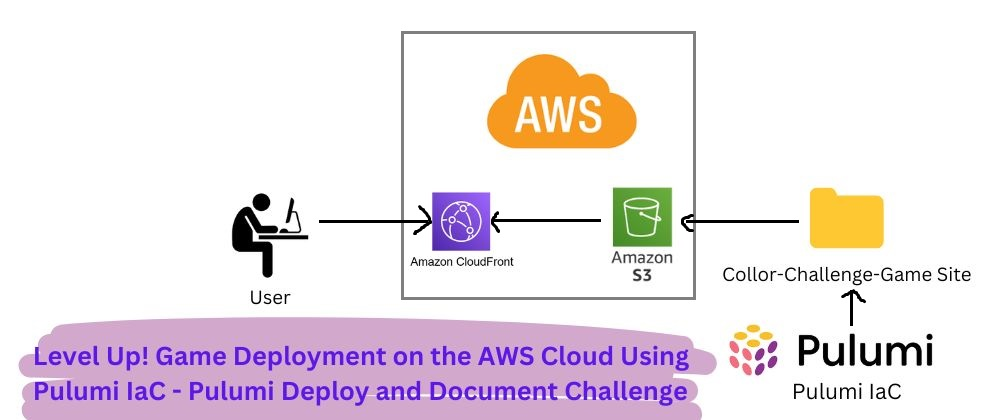

# Level Up! Game Deployment on AWS Cloud Using Pulumi IaC - Pulumi Deploy and Document Challenge

This is a submission for the **Pulumi Deploy and Document Challenge: Fast Static Website Deployment**.



## Objective
As an advocate for Infrastructure as Code (IaC), my aim is to demonstrate how easy and efficient it can be to deploy cloud infrastructure using **Pulumi**. In this project, I’m using **Pulumi** to deploy a static website (Color Recall Challenge Game) on AWS. The goal is to show the power of Pulumi IaC in deploying cloud services programmatically using your favorite programming language, which in this case is **Python**.

## What I Built - Color Recall Challenge Game
I have developed a simple, elegant **Single Page Color Recall Game** to challenge users’ color memory and visual recall skills. It is designed as a **static website** to show how we can quickly deploy static websites using Pulumi.

### Game Features:
- 10 levels of increasing difficulty.
- The user must remember and select the right color.
- Incorrect choices result in the end of the game.

### Demo
https://github.com/user-attachments/assets/3db5de5b-afc4-4901-bc8a-6e9e861a7772

Live Demo Links:
- **CloudFront URL**: [CloudFront Link](https://d20soi00v745g7.cloudfront.net/)
- **S3 Bucket Public URL**: [S3 Bucket Link](http://color-challenge-website-bucket-4b4dc09.s3-website-us-east-1.amazonaws.com/)

## Project Repository
This repository contains the code and setup instructions for deploying the **Color Challenge Game** using **Pulumi IaC** using Python as the Tech Stack.

- **GitHub Repository**: [mohamednizzad / pulumi-challenge](https://github.com/mohamednizzad/pulumi-challenge)

## My Journey - Moving the Color Challenge Game to Production with Pulumi

⚠️ **Assumption**: This tutorial assumes you're starting with a fresh installation of **Windows**. For other OS, please refer to Pulumi’s official [Get Started guide](https://www.pulumi.com/docs/get-started/).

🚨 **Costs**: All services used in this tutorial are free as long as they remain within the free tier limits. Exceeding the free tier may incur charges, so be mindful of resource consumption.

### Prerequisites
1. **Email Account**: For account creation (e.g., Gmail).
2. **Pulumi Account**: [Sign Up for Free](https://www.pulumi.com).
3. **Cloud Platform Access**: Create an [AWS free tier account](https://aws.amazon.com/free/).
   - Note: AWS free tier applies, but exceeding the free tier may incur costs.
4. **AWS CLI**: [Download AWS CLI](https://docs.aws.amazon.com/cli/latest/userguide/install-cliv2.html).
5. **VS Code**: [Download Visual Studio Code](https://code.visualstudio.com/).
6. **Python**: [Download Python](https://www.python.org/).

---

## Step-by-Step Guide to Deploy the Color Challenge Game

### Step 01: Install Pulumi

1. Open **Windows PowerShell** as Administrator and run:

```bash
choco install pulumi
```

Then, press Enter. You’ll be asked to confirm permission to run the installer—go ahead and allow it to continue. Now, type Yes and press Enter. Pulumi will begin installing smoothly, as shown below.

To check if Pulumi was installed successfully, open PowerShell again, enter the following command, and press Enter.

```bash
pulumi version
```
### Video Demo of Step 01
https://github.com/user-attachments/assets/cfab9a3f-94d4-4d47-a9a2-3c89099d599c

### Step 02: Creating an AWS IAM User with Required Credentials
After installing Pulumi, we need to give it the necessary permissions to deploy and manage cloud resources. To do this, Pulumi requires programmatic access using proper access credentials.

In this case, we need to create an AWS Identity and Access Management (IAM) user with the right permissions. So, let's create an IAM user that Pulumi can use to manage services on our cloud platform. We’ll create a new IAM user named pulumi-user and attach the following policies to it:

- AdministratorAccess: This policy provides full access to AWS services and resources.
- AmazonS3FullAccess: This policy provides full access to all buckets via the AWS Management Console.

### Video Demo of Step 02 on How to create an IAM User pulumi-user
https://github.com/user-attachments/assets/95efd7c5-acff-4661-b7f1-b034d9832c6e

### Step 03 - Deploying Color Challenge Game to AWS S3 Bucket

#### 👉 1. Create a Project Directory
Open VS Code ▶️ From the top menu, go to Terminal and click on New Terminal. Alternatively, you can use the shortcut Ctrl + Shift + ' to open the terminal quickly.
Once the terminal is open, run the following commands to create and navigate to the color-code-challenge directory:
```bash
cd desktop
mkdir color-challenge-code
cd color-challenge-code
```

#### 👉 2. Log in to Pulumi
Log in to your Pulumi account. This will open your browser for authentication.
Run the following command:
```bash
pulumi login
```

#### 👉 3. Initialize a new Pulumi project using AWS and Python as the stack.
To initialize a new pulumi project, run the following code:
```bash
pulumi new aws-python
```
You’ll be prompted with a few questions. You can simply press Enter to accept the default values, or type in your own preferred values if you wish.
The pulumi new command creates a new Pulumi project with some basic scaffolding based on the cloud and language specified.

#### 👉 4. Configure AWS CLI Credentials
Run the command below to provide your AWS credentials (Access Key and Secret Access Key) that we created in Step 02.
This will allow Pulumi to access your AWS account and deploy the website to the S3 bucket.
```bash
aws configure
```
Using aws configure within Visual Studio Code allows us to set up our AWS credentials and region. These settings are then used by VS Code extensions to interact with our AWS resources.

#### 👉 4.1. Add Project Folder to VS Code Workspace
In VS Code, go to the File menu and select Add Folder to Workspace.
A dialog box will appear titled Add Folder to Workspace. From there, select the Color-Challenge-Game folder and click the Add button.
Now, replace the **__ main.py__** file with the **__main.py__** file available from this repository:

Next, download the **www** folder from this repository and move it into the **Color-Challenge-Game** project directory.
**Note: ** You can place any static website (with its files and folders) inside the www folder within the Color-Challenge-Game project, and it will work without any issues.
Now that we’ve completed all the steps, our project is ready to be deployed. Check the folder directory to ensure it matches the structure shown in the image below.

#### 👉 5. Preview the Deployment
Run the following code to preview the deployment. This will list the resources that will be created.
```bash
pulumi preview
```

#### 👉 6. Let's Deploy the Infrastructure
Run the following code and choose **Yes** to deploy the **Color-Challenge-Game** project website.
```bash
pulumi up
```
This step will complete the deployment successfully.
After successful deployment, you’ll get two links
- S3 Static Site URL (http)
- CloudFront CDN URL (https)

#### 👉 7. Destroy the resources provisions by Pulumi
To remove everything provisioned by Pulumi, simply run the following code:
```bash
pulumi destroy
```

To remove the stack, run the following code:
```bash
pulumi stack rm
```
This concludes the step-by-step, beginner-friendly tutorial on how to deploy a static website using Pulumi IaC on an AWS S3 Bucket and provision it through CloudFront.

### Video Demo of Step 03 From 1 to 7 on Deploying Color Challenge Game to AWS S3 Bucket
https://github.com/user-attachments/assets/76ef2278-ec1d-4417-a952-4bc42ac5d31b

### A Complete Step-by-Step tutorial along with screenshots are available in the main challenge article submission at [Dev.to](https://dev.to/mohamednizzad/level-up-game-deployment-on-the-aws-cloud-using-pulumi-iac-pulumi-deploy-and-document-challenge-63n).

Crafted By [Mohamed Nizzad](https://www.linkedin.com/in/mohamednizzad/) with the 💝 for [Amazon Web Services](https://aws.amazon.com/free/). ⛅ and [Pulumi](https://www.pulumi.com) motivated by [Dev.to](https://dev.to/mohamednizzad/level-up-game-deployment-on-the-aws-cloud-using-pulumi-iac-pulumi-deploy-and-document-challenge-63n).
